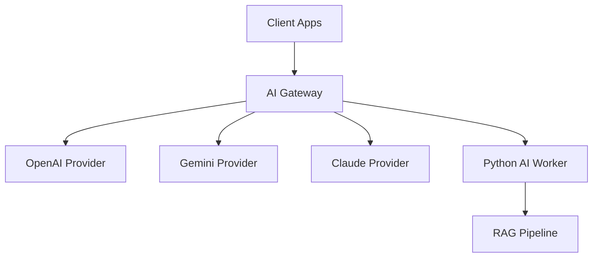
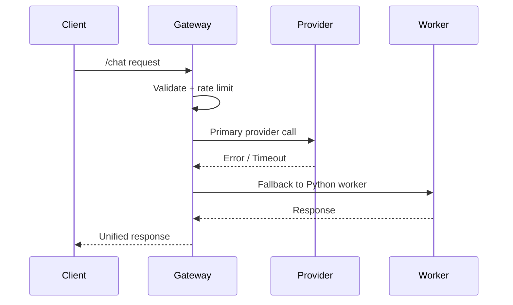

# AI Gateway & AI Orchestrator (Java + Python)
## Production-Grade System Documentation (Full Version)

---

# 1. Overview

This document provides a complete production-grade architecture and implementation guide for an **AI Gateway + AI Worker** system, designed for high-scale enterprise usage.  
It defines an extensible platform combining Java (Spring Boot/WebFlux) and Python (FastAPI, vLLM, inference engines) to unify, route, optimize, and monitor all AI usage inside an organization.

The system is designed to:

- Handle **millions of AI requests** efficiently.
- Route requests to multiple providers (OpenAI, Gemini, Claude, Llama, Qwen, local models…).
- Provide **standardized API responses**, retry logic, fallback strategies.
- Support **multi-model orchestration**, usage tracking, and cost optimization.
- Integrate Python workers for model inference or specialized tasks.
- Enable seamless enterprise integration (auth, logging, billing, workflows).

---

# 2. System Architecture

```
                   ┌──────────────────────────────┐
                   │         Client Apps           │
                   │  (Mobile, Backend, Web)       │
                   └──────────────┬───────────────┘
                                  │ HTTPS
                                  ▼
                   ┌──────────────────────────────┐
                   │        AI Gateway (Java)      │
                   │  - Routing                    │
                   │  - Fallback                   │
                   │  - Rate limit                 │
                   │  - Caching                    │
                   │  - Authentication             │
                   │  - Observability              │
                   └──────────────┬───────────────┘
      ┌────────────────────────────┼────────────────────────────┐
      │                            │                            │
      ▼                            ▼                            ▼
┌────────────┐         ┌────────────────┐           ┌────────────────┐
│ OpenAI API │         │ Gemini API     │           │ Claude API      │
└────────────┘         └────────────────┘           └────────────────┘
      │                            │                            │
      └──────────────────────┬──────────────────────────────────┘
                             ▼
                   ┌──────────────────────────────┐
                   │      Python AI Worker        │
                   │  - Local LLM (vLLM)          │
                   │  - Embedding generator       │
                   │  - RAG pipelines             │
                   │  - OCR, CV models            │
                   │  - Custom fine-tuned models  │
                   └──────────────────────────────┘
```

---

# 3. Core Components

## 3.1. AI Gateway (Java, Spring Boot/WebFlux)
Handles:
- Unified API for all AI interactions.
- Asynchronous request processing.
- Circuit breaker, retry strategies.
- Cost-aware model routing.
- Authentication & quota limits.
- Global caching (Redis).
- Observability (Prometheus, OpenTelemetry).
- API versioning and backward compatibility.

## 3.2. AI Worker (Python)
Handles:
- Inference using local LLMs (via vLLM / GGUF).
- Specialized ML tasks (OCR, CV, speech-to-text).
- Embedding generation.
- RAG retrieval and orchestration.
- Pre/post-processing for model inputs.

---

# 4. Detailed Gateway Architecture (Java)

## 4.1. Key Modules

```
/src/main/java/com/company/aigateway
│
├── controller/
│     ├── ChatController.java
│     ├── EmbeddingController.java
│     └── ModerationController.java
│
├── service/
│     ├── RoutingService.java
│     ├── ProviderService.java
│     ├── FallbackService.java
│     ├── CacheService.java
│     └── UsageTrackingService.java
│
├── provider/
│     ├── OpenAIClient.java
│     ├── GeminiClient.java
│     ├── ClaudeClient.java
│     └── PythonWorkerClient.java
│
├── config/
│     ├── WebClientConfig.java
│     ├── RateLimitConfig.java
│     └── OpenTelemetryConfig.java
│
└── util/
      ├── RetryUtils.java
      └── JsonUtils.java
```

---

# 5. Routing Logic Specification

## 5.1. Basic Flow

```
Client Request
      │
      ▼
Gateway receives → Validate API key → Check quota → Parse model →  
      │
      ├─► If provider = external (GPT/Gemini): call API
      │
      ├─► If provider = python-worker: route to internal worker
      │
      ├─► If failure: retry → fallback provider
      │
      ▼
Return standardized response
```

## 5.2. Fallback Mechanisms
1. Primary provider unavailable → secondary provider.
2. Timeout → retry 2 times with exponential backoff.
3. LLM result quality check → optionally re-route to higher-tier model.

---

# 6. Python Worker Architecture

```
/worker
│
├── app.py (FastAPI)
├── routers/
│     ├── chat.py
│     ├── embedding.py
│     ├── rag.py
│     └── cv.py
│
├── models/
│     ├── llm_vllm.py
│     ├── embedding_sentence_transformer.py
│     └── ocr_paddle.py
│
├── rag/
│     ├── vector_store.py
│     ├── retriever.py
│     ├── generator.py
│     └── pipeline.py
```

---

# 7. API Specification (OpenAPI-style)

## 7.1. Chat Completion Endpoint

```
POST /v1/chat/completions
{
  "model": "gpt-4o-mini",
  "messages": [
    { "role": "user", "content": "Hello" }
  ],
  "temperature": 0.7
}
```

### Response
```
{
  "id": "chatcmpl-123",
  "model": "gpt-4o-mini",
  "choices": [
    {
      "index": 0,
      "message": { "role": "assistant", "content": "Hi! How can I help?" }
    }
  ]
}
```

---

# 8. Observability & Monitoring

## 8.1. Metrics (Prometheus)
- request_count  
- request_latency  
- provider_failure_rate  
- cost_per_request  
- model_usage_distribution  

## 8.2. Distributed Tracing
Using **OpenTelemetry**:
- trace gateway → provider → worker → DB.
- visualize using Jaeger / Grafana Tempo.

---

# 9. High Availability Architecture

```
                   ┌────────────────────────┐
                   │  Load Balancer (L7)    │
                   └───────────┬────────────┘
                               ▼
             ┌──────────────────────────────────┐
             │      AI Gateway replicas          │
             │   scale 5–50 instances            │
             └───────────┬────────────┬─────────┘
                         │            │
                         ▼            ▼
                 Redis Cluster    Kafka Queue (optional)
                         │            │
       ┌─────────────────┼────────────┼─────────────────┐
       ▼                 ▼            ▼                 ▼
Python Worker 1   Python Worker 2   Python Worker N   Vector DB
```

---

# 10. CI/CD Pipeline

## Gateway (Java)
- Build with Maven.
- Run unit tests + integration tests.
- SonarQube quality gate.
- Build Docker image.
- Deploy to Kubernetes.

## Worker (Python)
- Black + Ruff lint.
- PyTest.
- Build Docker.
- Upload to registry.
- Rollout deployment with auto-healing.

---

# 11. Security Hardening Checklist

- Enforce HTTPS/TLS 1.2+.
- JWT for internal auth.
- HMAC for worker communication.
- IP allowlist for admin endpoints.
- Audit logs for all AI actions.
- Rate limit per user + per token.
- Encrypt all stored logs with AES-256.

---

# 12. Test Strategy

### Unit
- Routing logic  
- Provider mocks  
- Validation rules  

### Integration
- End-to-end call → fallback test  
- Load tests (10k RPS)  
- Timeout & retry behavior  

### AI Evaluation
- LLM output quality scoring  
- Regression test for model updates  

---

# 13. Performance Benchmarks (Expected)

| Component | Latency (p95) |
|----------|---------------|
| Gateway → Provider API | 150–300ms |
| Gateway → Python Worker (local vLLM) | 80–120ms |
| Embedding Worker | 5–10ms |
| RAG Pipeline | 100–200ms |

---

# 14. 30-Day Roadmap

### Week 1
- Architect system  
- Implement baseline Gateway  
- Create Python Worker base  
- External provider integration  

### Week 2
- Full routing + caching  
- Authentication & quota  
- Logging & Observability  

### Week 3
- Python Worker LLM integration (vLLM)  
- Embedding + RAG pipeline  

### Week 4
- Load testing  
- Hardening  
- Production deployment  

---

# 15. Future Extensions

- Multi-agent workflows  
- RAG v2 with hybrid search  
- Automatic prompt optimization  
- Cost-aware intelligent routing  
- Fine-tuned local models  
- Human-in-the-loop evaluation system  

---

# Appendix A — Mermaid Diagrams

## System Diagram



## Routing Logic



---

# END OF DOCUMENT
