# NewsPulse Data Flow Documentation

This document describes the complete data flow from news crawling to API serving.

## System Architecture

```mermaid
flowchart LR
    subgraph Sources["📰 News Sources"]
        S1[VNExpress]
        S2[Tuổi Trẻ]
        S3[Thanh Niên]
        S4[Zing News]
        S5[Vietnamnet]
        S6[CafeF]
        S7[Kenh14]
    end

    subgraph Ingestion["🔄 Data Ingestion"]
        C[Crawler<br/>Scala]
        K1[(Kafka<br/>news_raw)]
    end

    subgraph Processing["⚙️ Data Processing"]
        ETL[Spark ETL<br/>Scala]
        K2[(Kafka<br/>news_cleaned)]
        EMB[Embedding<br/>Python]
        K3[(Kafka<br/>news_embedding)]
    end

    subgraph Storage["💾 Storage"]
        DL[(Delta Lake)]
        ES[(Elasticsearch)]
    end

    subgraph Analytics["📊 Analytics"]
        TC[Topic Clustering<br/>Scala]
        TE[Trending Engine<br/>Scala]
    end

    subgraph Serving["🌐 Serving"]
        API[Spring Boot API]
        FE[Frontend]
    end

    Sources --> C
    C --> K1
    K1 --> ETL
    ETL --> K2
    K2 --> EMB
    EMB --> K3
    K3 --> DL
    DL --> TC
    TC --> TE
    TE --> ES
    K3 --> ES
    ES --> API
    API --> FE
```



## Data Flow Stages

### Stage 1: Web Crawling

**Component:** `crawler-scala`

**Input:** News websites (HTML)

**Output:** Raw article JSON to Kafka `news_raw`

**Process:**
1. Scheduler triggers crawlers every 15 minutes
2. Each source-specific crawler:
   - Fetches category pages
   - Extracts article URLs
   - Parses individual articles
   - Extracts: title, content, author, publish time, images, tags
3. Produces JSON to Kafka with key = article URL hash

**Data Schema (news_raw):**
```json
{
  "id": "md5-hash-of-url",
  "url": "https://vnexpress.net/...",
  "title": "Article title",
  "description": "Article summary",
  "content": "Full article text",
  "author": "Author name",
  "source": "vnexpress",
  "category": "thoi-su",
  "tags": ["tag1", "tag2"],
  "imageUrl": "https://...",
  "publishTime": 1702234567890,
  "crawlTime": 1702234567890
}
```

---

### Stage 2: ETL Processing

**Component:** `etl-spark-scala`

**Input:** Kafka `news_raw`

**Output:** Cleaned articles to Kafka `news_cleaned` + Delta Lake

**Process:**
1. Spark Structured Streaming reads from Kafka
2. Text cleaning:
   - Remove HTML tags
   - Decode HTML entities
   - Normalize Vietnamese Unicode
   - Remove special characters
3. Language detection
4. Deduplication using simhash
5. Content validation (length checks)
6. Write to `news_cleaned` topic and Delta Lake raw zone

**Added Fields:**
```json
{
  "language": "vi",
  "word_count": 523,
  "process_time": "2024-12-10T12:00:00Z"
}
```

---

### Stage 3: Embedding Generation

**Component:** `embedding-service-python`

**Input:** Kafka `news_cleaned`

**Output:** Articles with embeddings to Kafka `news_embedding`

**Process:**
1. Kafka consumer reads cleaned articles
2. Concatenate: title + description + content (limited)
3. Generate embedding using Sentence Transformers
   - Model: `paraphrase-multilingual-mpnet-base-v2`
   - Dimensions: 768
4. Produce to `news_embedding` topic

**Added Fields:**
```json
{
  "embedding": [0.123, -0.456, ...],  // 768 floats
  "embedding_model": "paraphrase-multilingual-mpnet-base-v2",
  "embedding_time": "2024-12-10T12:01:00Z"
}
```

---

### Stage 4: Topic Clustering

**Component:** `topic-clustering-scala`

**Input:** Delta Lake embedding zone

**Output:** Cluster assignments to Delta Lake

**Process:**
1. Load articles with embeddings (last 24 hours)
2. Convert embeddings to Spark ML vectors
3. Run Bisecting K-Means clustering
4. Assign cluster IDs
5. Generate cluster labels using TF-IDF on titles
6. Compute cluster statistics:
   - Size, source diversity
   - Time span
   - Representative title

**Added Fields:**
```json
{
  "cluster_id": 42,
  "cluster_label": "Bão số 5 | miền Trung"
}
```

---

### Stage 5: Trending Detection

**Component:** `trending-engine-scala`

**Input:** Clustered articles

**Output:** Trending scores to Delta Lake + Kafka

**Process:**
1. Window aggregation (10-minute windows, 1-minute slide)
2. Count articles per cluster per window
3. Calculate metrics:
   - **Frequency**: Article count
   - **Velocity**: Articles per minute
   - **Source Diversity**: Unique source count
   - **Recency**: Time decay factor
4. Compute trending score:
   ```
   score = 0.25*frequency + 0.25*velocity + 0.25*diversity + 0.25*recency
   ```
5. Detect spikes using z-score (breaking news)
6. Output top trending topics

**Trending Topic Schema:**
```json
{
  "cluster_id": 42,
  "title": "Representative title",
  "article_count": 15,
  "source_count": 5,
  "sources": ["vnexpress", "tuoitre", ...],
  "trending_score": 85.6,
  "rank": 1,
  "is_spike": true,
  "velocity": 3.2
}
```

---

### Stage 6: Search Indexing

**Component:** `search-indexer-java`

**Input:** Kafka `news_embedding`

**Output:** Elasticsearch index

**Process:**
1. Consume articles with embeddings
2. Batch articles (100 per batch)
3. Bulk index to Elasticsearch
4. Index mapping includes:
   - Text fields for BM25 search
   - Dense vector field for semantic search
   - Keyword fields for filtering

---

### Stage 7: API Serving

**Component:** `api-springboot`

**Input:** Elasticsearch queries

**Output:** REST API responses

**Endpoints:**
- `GET /api/trending` - Trending topics
- `GET /api/trending/breaking` - Breaking news
- `GET /api/search?q=...` - Keyword search
- `POST /api/search/semantic` - Vector search
- `GET /api/search/hybrid` - RRF fusion search
- `GET /api/articles/{id}/related` - Related articles
- `POST /api/recommendations` - Personalized recommendations

---

## Data Retention

| Layer | Retention | Format |
|-------|-----------|--------|
| Kafka (raw) | 7 days | JSON |
| Kafka (cleaned) | 30 days | JSON |
| Delta Lake (raw) | 90 days | JSON |
| Delta Lake (clean) | 365 days | Parquet |
| Delta Lake (embedding) | 90 days | Delta |
| Elasticsearch | 30 days | Indexed |

---

## Latency Targets

| Stage | Target Latency |
|-------|----------------|
| Crawl → Kafka | < 5 seconds |
| ETL processing | < 10 seconds |
| Embedding generation | < 2 seconds |
| Clustering (batch) | < 5 minutes |
| Trending update | < 1 minute |
| Search indexing | < 10 seconds |
| API response | < 100ms |

---

## Monitoring

- **Kafka**: Lag monitoring, throughput
- **Spark**: Job duration, failure rate
- **Elasticsearch**: Index size, query latency
- **API**: Request rate, error rate, p99 latency
